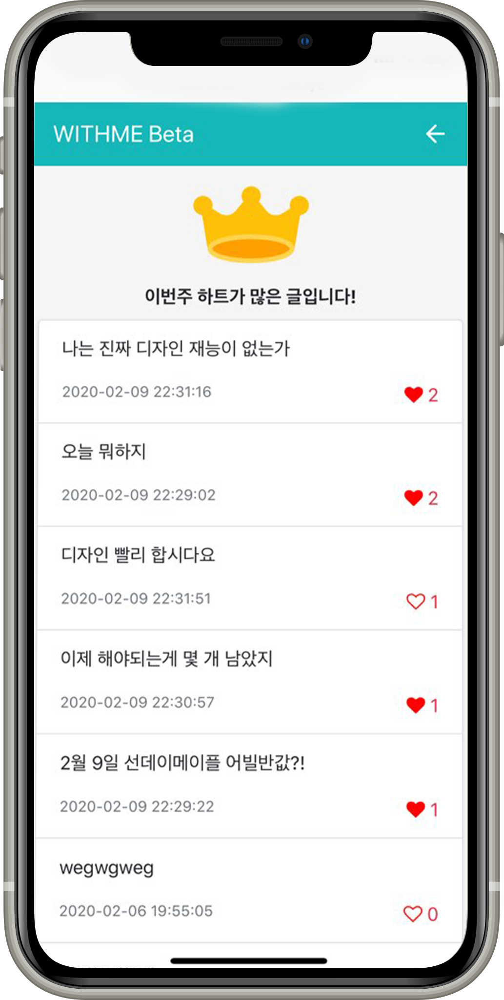
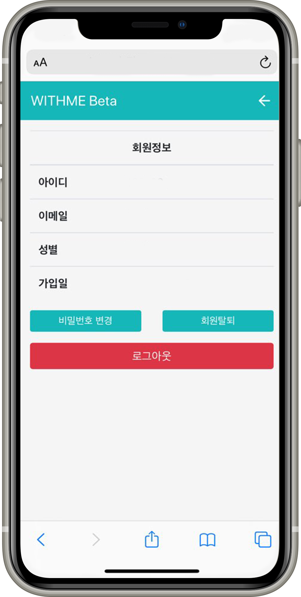

# withme

<h2 style='color:#3f3f'>메인 페이지</h2>

검색을 동적으로 처리하였으며, 참가 버튼 클릭 시 명 수가 증가하며 참가 취소를 할 수 있다.
 
또한 각 게시글마다 왼쪽으로 넘기면 댓글을 입력 할 수 있고, 
각 게시글은 종료 시간이 되면 하루 뒤 자동으로 삭제된다.
 

<h2 style='color:#3f3f'>글쓰기</h2>

글쓰기에는 제목과 내용을 작성하며, 시작시간과 마감시간, 인원수를 입력할 수 있으며
 
이를 데이터베이스에 저장한다.

<h2 style='color:#3f3f'>랭킹</h2>

게시글을 한 주 단위로 하트가 가장 많은 순으로 정렬하여 랭킹을 나타낸다. 
이는 데이터베이스에서 1주일단위로 처리하여 하트 순으로 정렬하였다. 

<h2 style='color:#3f3f'>마이페이지</h2>

마이페이지에서 자신의 정보를 볼 수 있으며,  
비밀번호 변경 시 데이터베이스에서 해당 아이디의 비밀번호가 변경되며 
회원 탈퇴시 log에만 남아있고 user테이블에서만 회원 정보가 사라진다. 
또한 로그아웃시 해당 세션이 종료된다.
